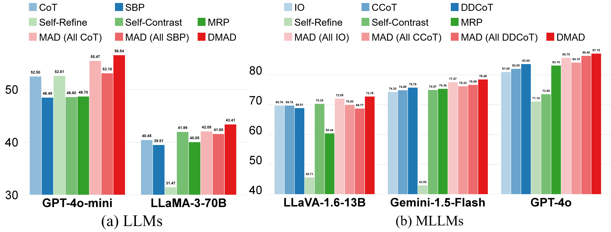

# [ICLR 2025] Breaking Mental Set to Improve Reasoning through Diverse Multi-Agent Debate [[paper]](https://openreview.net/forum?id=t6QHYUOQL7&referrer=%5BAuthor%20Console%5D(%2Fgroup%3Fid%3DICLR.cc%2F2025%2FConference%2FAuthors%23your-submissions))

## 📑 Abstrct

Large Language Models (LLMs) have seen significant progress but continue to struggle with persistent reasoning mistakes. Previous methods of *self-reflection* have been proven limited due to the models’ inherent fixed thinking patterns. While Multi-Agent Debate (MAD) attempts to mitigate this by incorporating multiple agents, it often employs the same reasoning methods, even though assigning different personas to models. This leads to a “fixed mental set,” where models rely on homogeneous thought processes without exploring alternative perspectives. In this paper, we introduce Diverse Multi-Agent Debate (DMAD), a method that encourages agents to think with distinct reasoning approaches. By leveraging diverse problem-solving strategies, each agent can gain insights from different perspectives, refining its responses through discussion and collectively arriving at the optimal solution. DMAD effectively breaks the limitations of fixed mental sets. We evaluate DMAD against various prompting techniques, including *self-reflection* and traditional MAD, across multiple benchmarks using both LLMs and Multimodal LLMs. Our experiments show that DMAD consistently outperforms other methods, delivering better results than MAD in fewer rounds.

## 🔎 What is mental set?

Our idea is inspired by the psychological theory of mental set. It refers to the cognitive tendency to approach problems in a particular way based on past experiences, learned behaviors, or established habits. While mental sets can enable quick solutions to familiar problems, they often hinder the ability to explore diverse approaches, particularly when faced with new or more complex tasks. It may be difficult to solve a problem in the mental set pattern. However, if thinking in a different way, it may surprisingly find it is easy to address the problem. 

We observe that LLMs have an analogous phenomenon. MAD with a fixed prompting strategy may always get wrong answers to a problem, while changing to another one can correctly solve it. This applies to MAD with each single prompting strategy.

For example, MAD with all IO thinking or CCoT thinking constantly gets wrong answers even with multiple rounds.

<div align="center">

</div>
<p align="center"> <b>MAD with all IO thinking.</b> </p>

<div align="center">

</div>
<p align="center"> <b>MAD with all CCoT thinking.</b> </p>

However, the agent thinking with DDCoT can accurately solve the problem, from which agents thinking with IO and CCoT can gain insights and correct their solutions to collectively arrive at the right answer.

<div align="center">

</div> 
<p align="center"> <b>DMAD with diverse thinking.</b> </p>


## 💡 Method

<div align="center">

</div>
<p align="center"> <b>Pipelines of different methods.</b> </p>

(a) *Self-reflection* uses a three-step strategy: generate response → evaluate it to get feedback → refine the response according to feedback. (b) MAD-persona sets the same model as debaters for affirmative and negative sides, and assigns a moderator to summarize their opinions. (c) MAD uses model instances to debate with each other in parallel. All agents think with the same reasoning method. (d) DMAD forces different agents to think with distinct reasoning methods. Each agent can extract useful information and gain insights from other agents to break mental set.


## 📊 Results

<div align="center">

</div>
<p align="center"> <b>Overall performance of each method on all benchmarks.</b> </p>

CoT: [Chain-of-Thought](https://proceedings.neurips.cc/paper_files/paper/2022/hash/9d5609613524ecf4f15af0f7b31abca4-Abstract-Conference.html?ref=https://githubhelp.com). SBP: [Step-Back Prompting](https://openreview.net/forum?id=3bq3jsvcQ1). [Self-Refine](https://proceedings.neurips.cc/paper_files/paper/2023/hash/91edff07232fb1b55a505a9e9f6c0ff3-Abstract-Conference.html). [Self-Contrast](https://aclanthology.org/2024.acl-long.197/). MRP: [Meta-Reasoning Prompting](https://arxiv.org/abs/2406.11698). IO: Input / Output Prompting. CCoT: [Compositional Chain-of-Thought](https://openaccess.thecvf.com/content/CVPR2024/html/Mitra_Compositional_Chain-of-Thought_Prompting_for_Large_Multimodal_Models_CVPR_2024_paper.html). DDCoT: [Duty-Distinct Chain-of-Thought](https://proceedings.neurips.cc/paper_files/paper/2023/hash/108030643e640ac050e0ed5e6aace48f-Abstract-Conference.html).

We evaluate DMAD against various prompting techniques, including *self-reflection* and traditional MAD, across multiple benchmarks including math, chemistry, physics, biology and so on, using both LLMs and Multimodal LLMs. Our experiments show that DMAD consistently outperforms other methods.

## 🔧 Usage

### Preliminaries

1. Clone this repository and navigate to DMAD folder.
```
https://github.com/MraDonkey/DMAD.git
cd DMAD
```

2. Using ```pwd``` to get your current directory and copy it to ``base_path`` in ```record.py```.


3. Create Conda Environment and Install Packages.
```
conda create -n DMAD python=3.11
conda activate DMAD
pip install -r requirements.txt
pip install -q -U google-generativeai
```

4. Prepare for Datasets.
```
python collect_dataset.py 
```

5. For the benchmark [MM-Vet](https://github.com/yuweihao/MM-Vet), you should download its dataset and unzip it in DMAD folder.


### Inference

To run llava models, you should clone its repository in DMAD folder.

```
git clone https://github.com/haotian-liu/LLaVA.git
```

Then revise the function ```eval_model``` in ```LLaVA/llava/eval/run_llava.py```.

```
def eval_model(args, dev = 'cuda', model_name = None, tokenizer = None, model = None, image_processor = None):
    # Model
    disable_torch_init()

    if model_name == None:
        model_name = get_model_name_from_path(args.model_path)
    if tokenizer == None:
        tokenizer, model, image_processor, context_len = load_pretrained_model(
            args.model_path, args.model_base, model_name, device = dev
        )
    if dev == 'cpu':
        model = model.float()

    qs = args.query
    if qs != None:
        image_token_se = DEFAULT_IM_START_TOKEN + DEFAULT_IMAGE_TOKEN + DEFAULT_IM_END_TOKEN
        if IMAGE_PLACEHOLDER in qs:
            if model.config.mm_use_im_start_end:
                qs = re.sub(IMAGE_PLACEHOLDER, image_token_se, qs)
            else:
                qs = re.sub(IMAGE_PLACEHOLDER, DEFAULT_IMAGE_TOKEN, qs)
        else:
            if model.config.mm_use_im_start_end:
                qs = image_token_se + "\n" + qs
            else:
                qs = DEFAULT_IMAGE_TOKEN + "\n" + qs

    if "llama-2" in model_name.lower():
        conv_mode = "llava_llama_2"
    elif "mistral" in model_name.lower():
        conv_mode = "mistral_instruct"
    elif "v1.6-34b" in model_name.lower():
        conv_mode = "chatml_direct"
    elif "v1" in model_name.lower():
        conv_mode = "llava_v1"
    elif "mpt" in model_name.lower():
        conv_mode = "mpt"
    else:
        conv_mode = "llava_v0"

    if args.conv_mode is not None and conv_mode != args.conv_mode:
        print(
            "[WARNING] the auto inferred conversation mode is {}, while `--conv-mode` is {}, using {}".format(
                conv_mode, args.conv_mode, args.conv_mode
            )
        )
    else:
        args.conv_mode = conv_mode

    conv = conv_templates[args.conv_mode].copy()
    if args.system != None:
        conv.system = args.system
    if args.messages != None:
        if '<image>\n' not in args.messages[0][1]:
            args.messages[0][1] = DEFAULT_IMAGE_TOKEN + '\n' + args.messages[0][1]
        conv.messages = args.messages
    else:
        conv.append_message(conv.roles[0], qs)
        conv.append_message(conv.roles[1], None)
    prompt = conv.get_prompt()

    if type(args.image_file) == str:
        image_files = image_parser(args)
        images = load_images(image_files)
    else:
        if type(args.image_file) == list:  
            images = [image_file.convert('RGB') for image_file in args.image_file]
        else:
            images = [args.image_file.convert("RGB")]
    image_sizes = [x.size for x in images]
    if dev == 'cpu':
        dtype = torch.float16#torch.FloatTensor
    else:
        dtype=torch.float16
    images_tensor = process_images(
        images,
        image_processor,
        model.config
    ).to(model.device, dtype=dtype)

    input_ids = (
        tokenizer_image_token(prompt, tokenizer, IMAGE_TOKEN_INDEX, return_tensors="pt")
        .unsqueeze(0)
        .cuda()
    )

    with torch.inference_mode():
        if dev == 'cpu': 
            output_ids = model.generate(
            input_ids.cpu(),
            images=images_tensor.float().cpu(),
            image_sizes=image_sizes,
            do_sample=True if args.temperature > 0 else False,
            temperature=args.temperature,
            top_p=args.top_p,
            num_beams=args.num_beams,
            max_new_tokens=args.max_new_tokens,
            use_cache=True,
        )
        else:
            output_ids = model.generate(
                input_ids,
                images=images_tensor,
                image_sizes=image_sizes,
                do_sample=True if args.temperature > 0 else False,
                temperature=args.temperature,
                top_p=args.top_p,
                num_beams=args.num_beams,
                max_new_tokens=args.max_new_tokens,
                use_cache=True,
            )

    outputs = tokenizer.batch_decode(output_ids, skip_special_tokens=True)[0].strip()
    print(outputs)
    return outputs
```

Run llava-v1.6-vicuna-13b model with basic prompting strategies.
```
python main.py  --model  llava-1.6-13b  --dataset <dataset_name> (ScienceQA, mm-vet)   --reasoning  <strategy_name> (io, ccot, ddcot)
```

Run gemini models.
```
python main.py  --model  <model_name>  --google_api_key  <your_api_key>  --dataset  <dataset_name>  --reasoning  <strategy_name> 
```

Run gpt models.
```
python main.py  --model  <model_name>  --openai_api_key  <your_api_key> --dataset  <dataset_name>  --reasoning  <strategy_name> 
```

Then you can run DMAD.
```
python main_DMAD.py  --model  <model_name>  --google_api_key  <your_api_key>  --openai_api_key  <your_api_key> --dataset  <dataset_name>  --reasoning  <strategy_name> 
```

### Evaluation

You can test the performance with
```
python test.py  --model  <model_name>  --dataset  --dataset  <dataset_name>  --reasoning  <strategy_name>
```

Results on MM-Vet will be saved in the folder ```mm_vet_jsons```, you can evaluate it with GPT-4 on their website [https://huggingface.co/spaces/whyu/MM-Vet_Evaluator].


## 🤗 Acknowledgment

The code is based on [LLaVA](https://github.com/haotian-liu/LLaVA) and [llm_multiagent_debate](https://github.com/composable-models/llm_multiagent_debate).


## ✒️ Citation

If you find our work helpful 🌞, please consider citing our paper 📃 and giving us a star ⭐.

```
@inproceedings{liubreaking,
  title={Breaking Mental Set to Improve Reasoning through Diverse Multi-Agent Debate},
  author={Liu, Yexiang and Cao, Jie and Li, Zekun and He, Ran and Tan, Tieniu},
  booktitle={ICLR},
  year={2025}
}
```